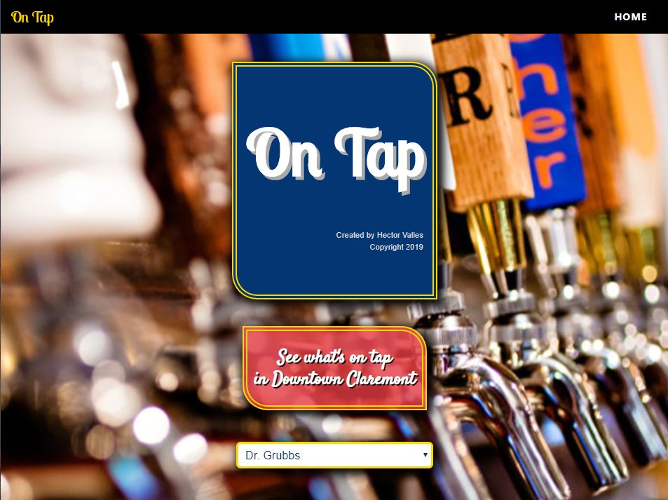

# On Tap Server

On Tap is an application that allows the user to see what beers are on tap in every restaurant/bar in Downtown Claremont. It provides you with the restaurants information as well as what beers they have on tap. The user can chose a particular beer to see further detailed information of the chosen beer.

Live app: https://on-tap-client.hmvalles75.now.sh/

server repo: https://github.com/Hmvalles75/On-Tap-Api

client repo: https://github.com/Hmvalles75/On-Tap-client

## Installation

clone github repo
install node dependencies, "npm install"
move example.env to .env
create database and replace example names in .env
migrate database, "npm run migrate"
run api, "npm start"

## Endpoints

#### GET '/restaurants'

Returns all the restaurants in area

#### GET '/restaurants/:id'

Returns restaurant by id with info on chosen restaurant

#### GET '/beers'

Returns all beers in database

#### GET '/beer/:id'

Returns beer by id with detailed information of chosen beer

## Technologies Used

HTML5
CSS3
JavaScript

React.js
Node.js
Express
PostgreSQL

Heroku
knex
Chai
Mocha
Supertest
